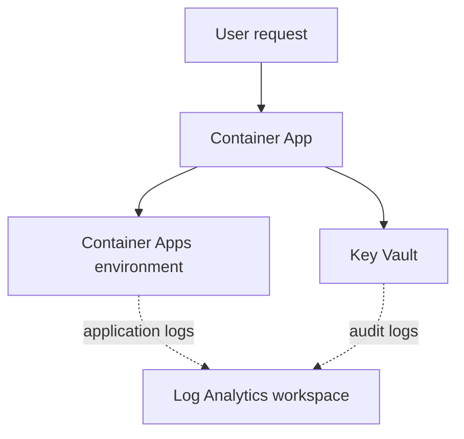

# OCTO Brown Bag: Azure Monitor Health Models

Training material for the **OCTO Brown Bag & Showcase Series: Azure Monitor Health Models**.

Azure Monitor health models add business context to existing metrics and logs. Instead of reviewing disconnected alerts, teams model workload components, dependencies, and an overall health state.

> Azure Monitor health models are currently in preview. Confirm current availability and behavior in the linked documentation before using them in production.

## Learning goals

By the end of the session, participants can:

- Explain entities, relationships, signals, health states, and health rollup.
- Describe how health models reduce alert noise and show service impact.
- Design a small model around a user or business outcome.
- Build and test a first health model in the Azure portal.

## Session outline

1. Why health modeling: from individual signals to end-to-end service health.
2. Azure Monitor health models: concepts, capabilities, preview status, and product direction.
3. Design practices and common patterns.
4. Hands-on lab: deploy a sample workload, model it, and inspect health evaluation.

## Sample workload

The Bicep template deploys a public hello-world Container App, a Container Apps environment, a locked-down Key Vault, and a Log Analytics workspace.

This is a training workload, not a production architecture. Azure consumption and log-ingestion charges may apply.

## Start the lab

Follow [docs/lab-guide.md](docs/lab-guide.md). Allow about 45 minutes.

## Repository layout

- `docs/lab-guide.md`: step-by-step lab and design guidance.
- `infra/main.bicep`: deployable sample workload using Azure Verified Modules.
- `infra/main.bicepparam`: example deployment values.

## References

- [Health models overview](https://learn.microsoft.com/azure/azure-monitor/health-models/overview)
- [Health model concepts](https://learn.microsoft.com/azure/azure-monitor/health-models/concepts)
- [Create a health model](https://learn.microsoft.com/azure/azure-monitor/health-models/create)
- [Azure Monitor documentation](https://learn.microsoft.com/azure/azure-monitor/)
- [Azure updates](https://azure.microsoft.com/updates/)

## Contributing

This project welcomes contributions and suggestions. Most contributions require you to agree to a [Contributor License Agreement](https://cla.opensource.microsoft.com) declaring that you have the right to grant us the rights to use your contribution.

This project has adopted the [Microsoft Open Source Code of Conduct](https://opensource.microsoft.com/codeofconduct/). See the [Code of Conduct FAQ](https://opensource.microsoft.com/codeofconduct/faq/) or contact [opencode@microsoft.com](mailto:opencode@microsoft.com) with questions.

## Trademarks

Use of Microsoft trademarks or logos must follow [Microsoft's Trademark and Brand Guidelines](https://www.microsoft.com/legal/intellectualproperty/trademarks/usage/general). Modified versions must not cause confusion or imply Microsoft sponsorship.
