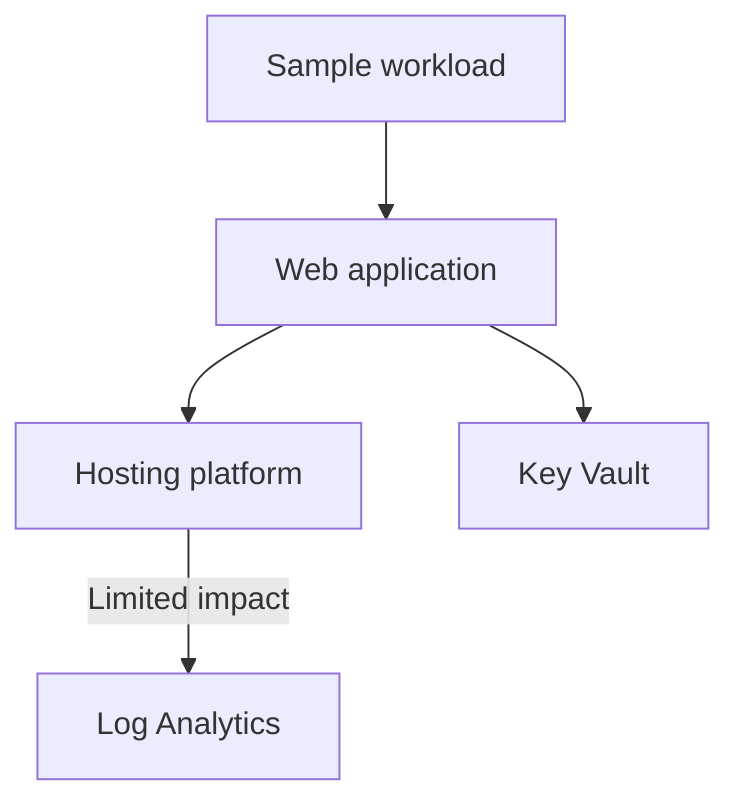

# Hands-on lab: Build your first health model

**Time:** 45 minutes  
**Goal:** Deploy a small workload, represent its dependencies, add health signals, and observe health rollup.

## 1. Prerequisites

You need:

- An Azure subscription.
- Azure CLI with Bicep support, or Azure Cloud Shell.
- **Contributor** on the target resource group to create a health model.
- Permission to create Container Apps, Key Vault, and Log Analytics resources.

Health models use a managed identity to read telemetry. A user-assigned identity needs **Monitoring Reader** on monitored resources and workspaces. See [health model permissions](https://learn.microsoft.com/azure/azure-monitor/health-models/create#permissions-required).

## 2. Deploy the sample workload

Open Bash in [Azure Cloud Shell](https://shell.azure.com) or a local terminal, then clone the repository and move to its root:

```bash
git clone https://github.com/Azure/octoahm0826.git
cd octoahm0826
```

Sign in to Azure and deploy the sample workload:

```bash
az login # not needed in azure cloud shell
az account set --subscription "<subscription-name-or-id>"

RESOURCE_GROUP="rg-octo-health-model-lab"
LOCATION="canadacentral"

az group create --name "$RESOURCE_GROUP" --location "$LOCATION"
az deployment group create \
  --resource-group "$RESOURCE_GROUP" \
  --template-file infra/main.bicep \
  --parameters infra/main.bicepparam \
  --parameters location="$LOCATION"
```

Get the sample URL and resource IDs:

```bash
az deployment group show \
  --resource-group "$RESOURCE_GROUP" \
  --name main \
  --query properties.outputs
```

Open the `appUrl` value in a browser. A hello-world page should appear. Wait several minutes for metrics and logs to become available.

## 3. Sketch the model first

Use this dependency chain:

```text
Sample workload (root)
└── Web application (Container App)
  ├── Hosting platform (Container Apps environment)
  │   └── Log Analytics (Log Analytics workspace)
  └── Key Vault (Key Vault)
```

The root answers: **Can users use the service?** The web application depends directly on its hosting platform and Key Vault. Log Analytics has limited impact because losing logs reduces operability but does not immediately stop the app.

## 4. Create the health model

1. In the Azure portal, open **Health Models** > **Create**.
2. Select the lab subscription and resource group.
3. Enter a name such as `octo-health-model-lab` and select a supported region.
4. On **Identity**, enable the system-assigned managed identity.
5. Select **Review + create**, then **Create**.

Health models are preview resources. If the menu or a region is unavailable, check the [current product documentation](https://learn.microsoft.com/azure/azure-monitor/health-models/create).

## 5. Add entities and relationships

1. Open the health model and select **Designer**.
2. Rename the root display name to `Sample workload`.
3. Select **Add entity** > **Azure resource**.
4. Add the deployed Container App, managed environment, Key Vault, and Log Analytics workspace.
5. Rename their display names to `Web application`, `Hosting platform`, `Key Vault`, and `Log Analytics`.
6. Connect parent to child by dragging from the parent's bottom handle to the child's top handle.
7. Connect `Web application` to both `Hosting platform` and `Key Vault`, then connect `Hosting platform` to `Log Analytics`.
8. Edit `Log Analytics` and set **Impact** to **Limited**.
9. Select **Save changes**.



A relationship means the parent depends on the child. The default **Worst of** rollup is appropriate for this small model.

## 6. Add health signals

Open each entity with **Edit**, then select **Signals**.

### Web application

1. Under **Azure resource**, select **Add a signal assignment**.
2. Use **Recommended** when available. Otherwise create a metric signal for replica count.
3. Use an unhealthy threshold of fewer than one running replica (Metric `Replica Count`).
5. Save the entity.

### Hosting platform, Key Vault, and Log Analytics

Add a **Log Analytics workspace** signal to each resource entity.

1. Add Log Analytics signals
2. Select Log analytics workspace
3. Select the octo Log Analytics workspace
4. Authorize if needed
5. Add signal

```kusto
ContainerAppConsoleLogs
| where TimeGenerated > ago(15m)
| summarize value = count()
```

For `Key Vault`, use the audit logs sent by its diagnostic setting:

```kusto
AZKVAuditLogs
| where TimeGenerated > ago(15m)
| summarize value = count()
```

The query must return one row with one numeric value. Choose thresholds that make sense for the exercise; production thresholds must come from workload objectives and observed baselines.

## 7. Observe evaluation

1. Open **Graph** to see the current state and topology.
2. Select an entity to inspect signal values and health history.
3. Open **Timeline** to review health over time.
4. Confirm that the root reflects health propagated from its children.

An **Unknown** state usually means telemetry is not available yet, the identity lacks access, or the signal has not completed its first evaluation.

## 8. Test a health change

For a reversible exercise, scale the Container App to zero and later restore it:

```bash
APP_NAME=$(az containerapp list \
  --resource-group "$RESOURCE_GROUP" \
  --query "[?contains(name, 'octo-health-app')].name | [0]" -o tsv)

az containerapp update \
  --resource-group "$RESOURCE_GROUP" \
  --name "$APP_NAME" \
  --min-replicas 0
```

Avoid sending requests while the app scales to zero. Wait for the signal refresh interval, then inspect **Graph**, **Timeline**, and entity details. Restore the app:

```bash
az containerapp update \
  --resource-group "$RESOURCE_GROUP" \
  --name "$APP_NAME" \
  --min-replicas 1 \
  --max-replicas 2
```

Metric evaluation is not immediate. If the replica signal does not change, use the graph to discuss missing-data behavior and try an available recommended signal instead.

## 9. Design checklist

- Start with a user or business outcome, not the resource inventory.
- Model real dependencies; keep decorative relationships out.
- Use generic entities for logical services, regions, or business flows.
- Use **Limited** for dependencies whose failure degrades but does not stop the parent.
- Use **Suppressed** only when a child must not affect parent health; it is not maintenance mode.
- Begin with a few actionable signals and tune thresholds from observed behavior.
- Alert at the highest entity that identifies meaningful user impact.
- Use one model per application or subsystem; nest models for portfolio views.

## 10. Clean up

Deleting the resource group removes the sample workload and stops its charges. Delete the health model separately if you created it elsewhere.

```bash
az group delete --name "$RESOURCE_GROUP" --yes --no-wait
```

## References

- [Configure the designer](https://learn.microsoft.com/azure/azure-monitor/health-models/designer)
- [Configure signals](https://learn.microsoft.com/azure/azure-monitor/health-models/signals)
- [Configure health rollup](https://learn.microsoft.com/azure/azure-monitor/health-models/rollup)
- [Analyze health state](https://learn.microsoft.com/azure/azure-monitor/health-models/analyze-health)
- [Health models FAQ](https://learn.microsoft.com/azure/azure-monitor/health-models/health-models-faq)
- [Azure Container Apps monitoring](https://learn.microsoft.com/azure/container-apps/observability)
- [Bicep documentation](https://learn.microsoft.com/azure/azure-resource-manager/bicep/)
